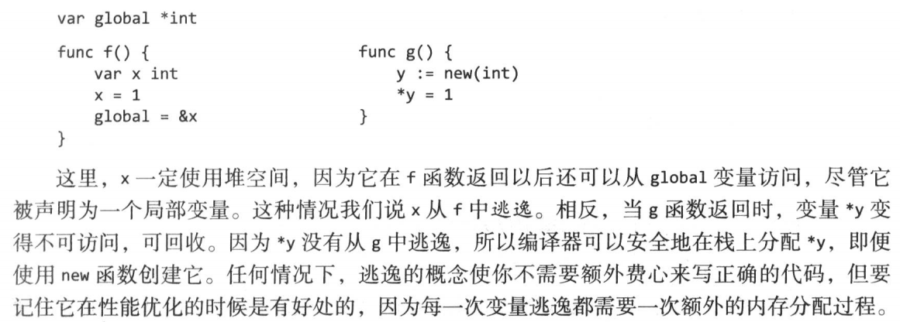

## 1.Golang基础

### 1.1 Golang语言有哪些特点？

1.  并发实现和控制简单。语言级别支持协程(goroutine)并发协程又称微线程，比线程更轻量、开销更小，性能更高（实际上协程就是一个线程同步执行多个任务），关键字（go）用于启动协程。**高并发是Golang语言最大的亮点 。**

2.  Golang内存自动回收。C/C++程序员需要自己管理内存的分配，增加了程序崩溃的可能性。

3.  编译。Go是一门静态语言，但是相对于C/C++，Golang在大型项目上的编译速度要快得多。编译过程可以参考这篇文章：[初探 Go 的编译命令执行过程](https://halfrost.com/go_command/)

4. 由于Golang诞生的比较晚（2009年），所以Golang天生具备了完善的网络编程接口，在Web服务开发上，Golang原生的接口就能高效完成基本任务。对框架的依赖远小于Java，python等等。

5. 编程规范。Go语言的编程规范强制集成在语言中，比如明确规定花括号摆放位置，强制要求一行一句，不允许导入没有使用的包，不允许定义没有使用的变量。通常开发中，我们使用gomat工具来强制格式化代码。

6. 异常处理。Golang不支持try...catch这样的异常处理方式，而是被调用函数直接返回异常值,例如：

   ~~~go
   buf := make([]byte, 100)
   n, err := r.Read(buf)   //此处直接返回err
   if err!= nil{
       log.Fatal("read error:",err)//打印日志看err详情
   }
   ~~~

7. 其他：Go语言没有VM，没有类概念，不支持继承，没有构造方法，没有注解，没有泛型，秉承less is more的极简思想。面试官再也不会让你判断这段代码输出的到底是汪汪汪还是喵喵喵了。

 ### 1.2 Golang语法

#### 1.2.1 名称

* 关键字:只能用在语法允许的地方，不能作为变量名。

<table>
    <tr>
      <td>break</td>
      <td>default</td>
      <td>func</td>
      <td>interface</td>
      <td>select</td>
   </tr>
   <tr>
      <td>case </td>
      <td>defer</td>
      <td>go</td>
      <td>map</td>
      <td>struct</td>
   </tr>
   <tr>
      <td>chan</td>
      <td>else</td>
      <td>goto</td>
      <td>package</td>
      <td>switch</td>
   </tr>
   <tr>
      <td>const</td>
      <td>fallthrough</td>
      <td>if</td>
      <td>range</td>
      <td>type</td>
   </tr>
   <tr>
      <td>continue</td>
      <td>for</td>
      <td>import</td>
      <td>return</td>
      <td>var</td>
   </tr>
</table>

* 常量：true/false/nil/iota

* 类型：

  |         整数类型          |             浮点型              |             其他数字类型              |
  | :-----------------------: | :-----------------------------: | :-----------------------------------: |
  |  uint8 无符号8位整型  | float32 IEEE-754 32位浮点型 |          byte 类似uint8          |
  | uint16 无符号8位整型  | float64 IEEE-754 64位浮点型 |          rune 类似int32          |
  | uint32 无符号32位整型 |  complex64 32位实数和虚数   |          uint 32或64位           |
  | uint64 无符号64位整型 |  complex128 64位实数和虚数  |        int 与uint一样大小        |
  |  int8 有符号8位整型   |                                 | uintptr 无符号整型，用于存放指针 |
  | int16 有符号16位整型  |                                 |        string 字符串bool         |
  | int32 有符号32位整型  |                                 |          bool 布尔类型           |
  | int64 有符号64位整型  |                                 |                                       |

  

#### 1.2.2 声明

变量声明：

~~~go
//普通变量声明
//var + 变量名 + 变量类型
var x int 
var i,j,k int
var b,f,s = true,2.3,"four"
//或者使用短变量声明:= 直接声明同时初始化
x := 1
b,f,s := true,2.3,"four"
//常量声明：
const pai = 3.1415
~~~

短变量 **:=** 声明的左侧必须有一个新变量：

~~~go
//通过
in,err := os.Open(fd)
out,err := io.Create(fd) //新变量out

//无新变量，不通过,编译错误
f, err := os.Open(fd)
f, err := io.Create(fd)
~~~

指针声明：

~~~go
//变量x
x := 1
//p代表x存放的地址，也就是指针,&为取址符号
p := &x
fmt.Println(*p) // "1"
//赋值
*p = 2
fmt.Println(*p) // "2"
~~~

new函数：

~~~go
//另一种创建变量的方式是使用内置的new函数
p := new(int)  //*int 类行的p,指向未命名的int变量
fmt.Println(*p) //输出 “0” 
*p = 2 			//赋值
fmt.Println(*p)  //输出 “2”
~~~

#### 1.2.3 变量的声明周期

​	生命周期指的是程序执行过程中，变量存在的时间段。包级别的变量生命周期是整个程序的执行时间。局部变量有一个动态的生命周期：从创建到没有不可访问（没有其他变量引用它），这个时候回收占用的空间。

​	包级变量，以及每个当前执行函数的局部变量都能作为GC Root。编译器可以选择在堆或者栈上分配空间，例如：

​	这里我们可以理解为，真局部变量（函数结束就回收空间的变量），在栈上分配空间，全局变量在堆上分配，详细的分配回收我们会在后续章节详述。

#### 1.2.4  易错点

~~~go
var cwd string
func init(){
    //此处使用短声明，会使全局变量cwd失效
    cwd,err := os.Get(xxx) 
    if err != nil {
        log.Fata("err",err)
    } 
}

//正确方法应该是：
var cwd string
func init(){
    var err error
    cwd, err = os.Get(xxx) //使用正常声明
    if err !=nil .....//省略
}
~~~

### 1.3 基本数据

​	Go的数据类行分四大类：基础类型（数字，字符串，布尔），聚合类型（数组），引用类型（指针），接口类型。

#### 1.3.1 基础类型

​	整型，浮点数，复数，布尔值，字符串，常量。

~~~go
//不同位数的int不能相互操作，例如相加
var apple int32 = 1
var oranges int16 = 2
var compote int = apple + oranges //编译错误

//强转型修正：
var compote int = int(apple) + int(oranges)

//字符串
s := "hello"
fmt.Println(len(s))// "5"
fmt.Println(s[0],s[2])//"h","l"
fmt.Println(s[len(s)]) //越界

//常量
const pi = 3.1415926
//声明多个常量
const (
    e = 2.7
    pi = 3.1415926
)
//常量生成器iota
const (
	Sunday  = iota
	Monday
    Tuesday
    ...
)
/*上面的声明中，Sunday的值为0，Monday为1，以此类推*/

~~~

#### 1.3.2 字符串和数字的转换

~~~go
//整数转字符串,一种是Sprintf，一种是strconv
x := 123
y := fmt.Sprintf("%d",x) 
//最常用的是 Atoi (string to int) and Itoa (int to string).
i, err := strconv.Atoi("-42")
s := strconv.Itoa(-42)
//FormatInt 和FormatUint 可以按进制转化
fmt.Print(strconv.FormatInt(int64(x),2))//"1111011"
//或者
s := fmt.Sprint("x=%b",x) //"x=1111011"
//Parse系列，将string转化成对应格式
b, err := strconv.ParseBool("true")
f, err := strconv.ParseFloat("3.1415", 64) //string to float,第二个参数代表float64
i, err := strconv.ParseInt("-42", 10, 64)//string to 10进制int64
u, err := strconv.ParseUint("42", 10, 64)
~~~

​	

### 1.4 复合数据类型

#### 1.4.1 数组

数组在所有语言里都有提及，这里就不累赘了。

在golang里用的比较多的是slice，slice和数组的区别就是，数组是固定大小，slice是动态变化的，所以这里先要分清，数组和slice在申请上的区别。

~~~go
/* 数组申请会确定数组内元素个数 */
//给定数组大小
var a [3]int = [3]int{1,2,3}
//用...自动确定数组大小
q := [...]int{1,2,3} //根据{1,2,3}分配三个元素大小的空间，实质上还是给定了数组的大小

~~~

#### 1.4.2 slice/切片

切片可以看成一个动态的数组，如下结构体代表了一个切片：

~~~go
type SliceHeader struct {
	Data uintptr  //指针指向切片开头
	Len  int	//切片的长度
	Cap  int	//目前最大容量
}
~~~

slice有着和python类似的索引方式，例如

~~~go
s := []int{1,2,3}
s_in := s[:1] //代表从索引0到索引1之前的元素，也就是[1]
/*需要注意的是，python有负索引，golang是没有的*/
s_in = s[:-1]  //编译出错
s_in = s[:len(s)-2] //正确写法，[1,2]
~~~

slice添加操作：

~~~go
 s = append(s,4) //[1 2 3 4]
//添加多个元素，数组
app := []int{5,6}
 s = append(s,app...) //三个点是语法糖，最终[1 2 3 4 5 6]
~~~

当slice容纳达到cap数量的时候，若继续往slice添加元素，会触发slice的扩容，具体扩容原理我们在后续章节讲解。

#### 1.4.3 map

~~~go
//创建
ages := make(map[string]int) //map[key]value
//创建+初始化
ages := map[string]int{
    "alice": 31,
    "charlie":34,
}
//同上
ages := make(map[string]int)
ages["alice"] = 31
ages["charlie"] = 34

//删除
delete(ages,"alice") //可删除不存在的元素

//遍历
for key,value := range ages{
    fmt.Println(key,value)
}
~~~

​	遍历字典的顺序是不确定的（在早年Golang版本是固定顺序），所以你要得到固定顺序的字典结果，那你只能把元素都取出来放在slice存储了。

​	Go没有提供集合类型，所以只能利用map key是唯一的性质来实现集合。

#### 1.4.5 结构体

